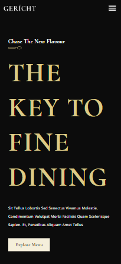

# Landing Page de Restaurante

Landing Page responsiva e moderna de um restaurante feita em React.

### Funcionalidades

O usuário deve ser capaz de:

- Ver um layout diferente para cada tamanho de tela. 
- Navegar pela página através dos links.
- Ver animações de hover nos elementos interativos da página.

### Feito com

- HTML
- CSS
- Flexbox
- JavaScript
- React
- useState(renderização condicional)
- useRef

### Screenshot

### Autor

[Simon Franklin](https://github.com/simonfranklin1)